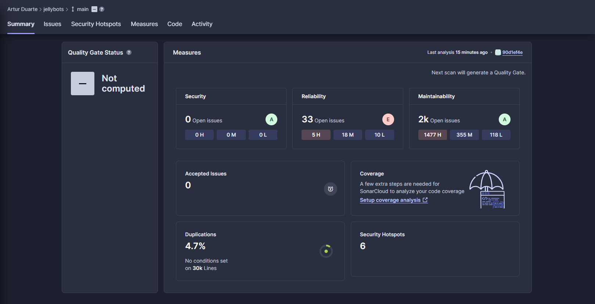
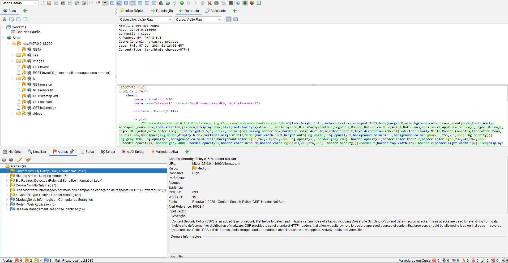

# 🔒 Testes de Qualidade de Código e Segurança

## ✅ Testes de Qualidade de Código

Para garantir a qualidade do código, foram realizadas análises detalhadas pelo SonarCloud, acessíveis através deste [relatório](https://sonarcloud.io/summary/overall?id=artur-duart_jellybots). O relatório enfatiza diversos aspectos cruciais para a segurança, confiabilidade e manutenção do código.

### Segurança

Embora a aplicação não apresente problemas críticos de segurança, o relatório identifica 30 pontos de atenção, incluindo potenciais vulnerabilidades de negação de serviço (DoS) relacionadas ao uso de expressões regulares com backtracking. Esses casos exigem revisão e otimização para prevenir ataques de DoS. Além disso, foram encontrados dois casos de uso de geradores de números pseudoaleatórios, que necessitam de avaliação para garantir a segurança da aplicação.

### Confiabilidade

A análise revela 33 problemas abertos, incluindo 5 de alta severidade, 18 de severidade média e 10 de baixa severidade. Por exemplo, o uso inseguro de ThrowStatement no arquivo public/js/app.js é um problema de alta severidade que pode causar falhas inesperadas na aplicação. Problemas de severidade média, como a ausência de uma família de fontes genéricas no arquivo public/css/bootstrap-icons.css, também foram identificados.

### Manutenibilidade

A área de manutenibilidade apresenta desafios significativos, com um total de 2.000 problemas abertos, incluindo 1.477 de alta severidade. Por exemplo, a duplicação de literais no arquivo config/database.php pode levar a erros difíceis de rastrear. Outros problemas incluem código comentado não utilizado em arquivos como app/Models/User.php, que precisam ser removidos para manter o código limpo e compreensível. A análise também aponta uma densidade de linhas duplicadas de 4,7% em três arquivos principais, indicando a necessidade de refatoração e reutilização de componentes de código.

### Boas Práticas e Arquitetura

Apesar dos desafios identificados, a aplicação adota boas práticas de desenvolvimento, incluindo o uso do framework Laravel e a arquitetura MVC. No entanto, há espaço para melhorias, como revisões de código mais frequentes e testes automatizados mais abrangentes.

## 🔐 Testes de Segurança

A análise de segurança realizada pelo OWASP ZAP destacou múltiplos alertas de média e baixa prioridade, ressaltando potenciais vulnerabilidades que requerem atenção imediata.

### Principais Preocupações

- **Content Security Policy (CSP):** A ausência deste cabeçalho representa um risco médio de segurança, pois ajuda a mitigar ataques como Cross Site Scripting (XSS) e injeção de dados.

- **Anti-clickjacking:** A falta deste cabeçalho pode expor a aplicação a ataques de ClickJacking, sendo essencial para garantir a integridade da mesma.

### Outras Vulnerabilidades

Outras questões identificadas incluem cookies sem o flag HttpOnly, que podem ser vulneráveis a hijacking de sessão, e a divulgação de informações através de cabeçalhos de resposta HTTP "X-Powered-By". Comentários suspeitos também foram encontrados, assim como a falta do cabeçalho X-Content-Type-Options.

Além disso, o OWASP ZAP sugere a utilização do Ajax Spider para explorar a aplicação automaticamente, indicando uma abordagem moderna para o desenvolvimento web. Também identifica um token de gerenciamento de sessão na resposta, útil para métodos baseados em cabeçalhos.

